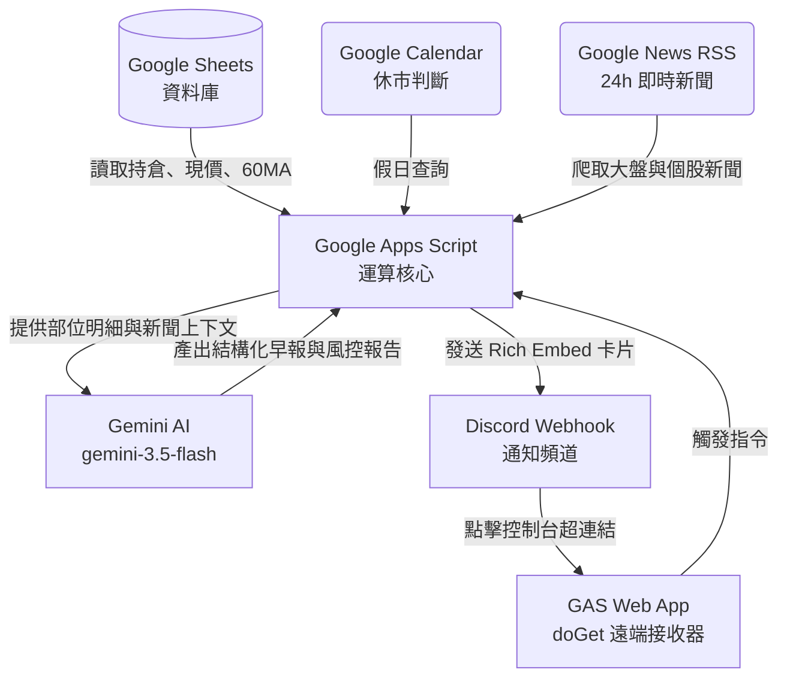

# 📈 個人投資監控助理 (Investment Monitor Bot) v14.4

這是一個基於 **Google Sheets**、**Google Apps Script ** 與 **Gemini** 打造的個人自動化投資監控與 AI 分析系統。透過 Discord Webhook 進行多市場的即時推播，並附帶專屬的 Discord 手機版互動控制台。

> [!IMPORTANT]
> **v14.4 更新**：將敏感金鑰（Discord Webhook URL 與 Gemini API Key）抽離至 Google Apps Script 的「指令碼屬性」中，可安全地將此專案託管至公開的 Git 儲存庫（如 GitHub），而無金鑰外洩風險。

---

## ✨ 核心功能

*   **🌍 多市場支援**：支援台股 (`TW`)、美股 (`US`)、加密貨幣 (`Crypto`) 的即時報價、均線回測與資產管理。
*   **📊 雙模監控**：支援「個股持倉損益計算」與「純指數點位監控（持股設為 0）」。
*   **🔔 智慧雙重警報**：
    *   **自訂波動門檻**：可針對個別標的設定大漲/大跌通知門檻（預設 3%, 5%, 10%），內建 30 分鐘防洪冷卻。
    *   **季線 (60MA) 觸及警報**：當股價進入季線上下 1% 範圍時，主動通知「回測」或「挑戰」狀態（內建 12 小時防洪冷卻）。
*   **🤖 盤後 AI 技術與風控分析**：
    *   自動統整當日持倉明細、累計總損益、單日漲跌幅及 60MA 季線。
    *   由 Gemini AI 扮演客觀的量化投資顧問，結合持倉狀態進行技術面與部位風險分析，給予專業嚴謹的避險或切入建議。
*   **🌅 盤前 AI 總經與個股新聞早報**：
    *   自動爬取 Google News 過去 24 小時的即時新聞。
    *   **大盤總經宏觀視野**：優先抓取美國聯準會 (Fed)、S&P 500、CPI 以及台股大盤、總經與台積電等核心事件。
    *   由 Gemini 進行結構化摘要，嚴守防幻覺原則，生成 400 字以內極易讀的盤前早報。
*   **🛌 智慧休市判斷**：自動連接 Google Calendar 的美國與台灣國定假日行事曆，休市期間自動暫停發送日報與 AI 分析，避免不必要的額度消耗。
*   **🎛️ Discord 遠端互動控制台**：
    *   一鍵推播控制台至 Discord 頻道。
    *   在手機 Discord 上點擊連結即可透過 GAS Web App 直接遠端觸發：盤前早報、盤後 AI 分析、數據日報或即時波動檢查。

---

## 🛠️ 系統架構

---

## 📝 Google Sheet 試算表結構設定

請確保試算表的工作表名稱為 **`Discord_Bot`**，欄位配置如下：

| 欄位 (Column) | 欄位名稱 | 填寫說明 | 範例 / 公式 |
| :--- | :--- | :--- | :--- |
| **A (1)** | 代號 (Symbol) | 股票或加密貨幣代號 | `2330.TW`, `VOO`, `BTC-USD` |
| **B (2)** | 市場 (Market) | 所屬市場分類（大寫） | `TW`, `US`, `Crypto` |
| **C (3)** | 股數 (Quantity) | 持有股數（若為 `0` 代表純監控指數，空白則忽略該列） | `1000` 或 `0` |
| **D (4)** | 平均成本 (Avg Cost) | 平均買入成本價 | `620.5` |
| **E (5)** | 現價 (Current Price) | 目前市價，使用 GoogleFinance 自動更新 | `=GOOGLEFINANCE(A2)` |
| **F (6)** | 累積總損益 | 計算累計報酬率（盤後 AI 分析風控的重要指標） | `=IF(C2>0, (E2-D2)/D2, "")` (型態設為百分比) |
| **G (7)** | 單日漲跌幅 | 當日股價漲跌幅，使用 GoogleFinance | `=GOOGLEFINANCE(A2, "changepct")/100` (型態設為百分比) |
| **H (8)** | 最後狀態紀錄 | **請保留空白**（程式會自動寫入警報標記以做冷卻判斷） | `📈 大漲 >3%` (程式寫入) |
| **I (9)** | 交易手續費率 | 計算預估淨損益時扣除的交易磨損費率 | `0.001425` |
| **J (10)** | 自訂波動門檻 | 該標的專屬的波動警報值（若留空則套用預設的 3/5/10%） | `0.02` (代表 2% 異動即警報) |
| **K (11)** | 匯率與保留區 | **特別注意：K2 儲存格**必須填入「美金兌台幣匯率」 | `32.5` |
| **L (12)** | 季線 60MA | 60 日移動平均線價格，可用於觸發季線警報 | `=AVERAGE(QUERY(GOOGLEFINANCE(A2, "price", TODAY()-100, TODAY()), "select Col2 order by Col1 desc limit 60"))` |

---

## ⏰ 自動化排程與發布設定

若要使系統在背景自動發送早報與監控股價，請於 Apps Script 左側選單點選 **「觸發器 (Triggers)」** ⏰ 並進行以下設定：

### 1. 排程觸發器建議
| 執行函數 | 活動來源 | 時間型態 | 建議執行時間 (台灣時間) |
| :--- | :--- | :--- | :--- |
| `checkStockPrice` | 時間驅動 | 分鐘計時器 | 每 10 分鐘 或 15 分鐘一次 |
| `morningBriefingTW` | 時間驅動 | 特定時間 | 每週一至週五 上午 8:00 至 9:00 |
| `morningBriefingUS` | 時間驅動 | 特定時間 | 每週一至週五 晚上 8:30 至 9:30 |
| `sendTwDailyReport` | 時間驅動 | 特定時間 | 每週一至週五 下午 3:30 至 4:30 |
| `sendUsDailyReport` | 時間驅動 | 特定時間 | 每週二至週六 早上 6:00 至 7:00 |
| `agentDailyAnalysisTW` | 時間驅動 | 特定時間 | 每週一至週五 下午 4:30 至 5:30 (收盤 AI 分析) |
| `agentDailyAnalysisUS` | 時間驅動 | 特定時間 | 每週二至週六 早上 7:00 至 8:00 (收盤 AI 分析) |

## 🧪 系統偵錯與檢測工具

本專案內建了兩個便於檢測的工具函數：
* **`testProperties()`**：執行後會在執行紀錄中確認 `DISCORD_WEBHOOK_URL` 與 `GEMINI_API_KEY` 是否有被 GAS 正確讀取，並輸出部分遮罩後的內容以供核對。
* **`sendDashboard()`**：手動執行此函數，會立刻發送一封「最新互動控制台 Embed 卡片」至您的 Discord，便於您一鍵手動操控所有分析。
